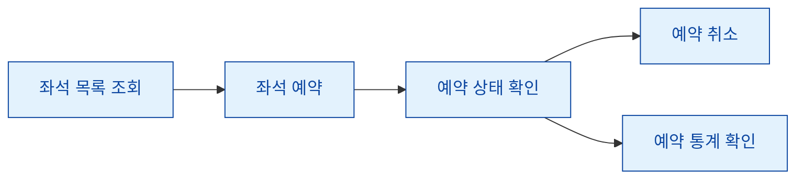

# 🎟️ Seat Reservation System CLI

좌석을 조회하고, 예약하고, 예약 상태를 확인하거나 취소할 수 있는 간단한 Python CLI 좌석 예약 시스템입니다.  
터미널 환경에서 영화관, 공연장, 세미나실 같은 좌석 예약 흐름을 작게 구현한 프로젝트입니다.

## 📌 Overview

Seat Reservation System CLI는 명령어 기반으로 좌석 예약을 관리하는 미니 예약 시스템입니다.

사용자는 전체 좌석 목록을 확인하고, 원하는 좌석을 예약할 수 있습니다.  
예약된 좌석의 상태를 확인하거나, 필요하면 예약을 취소할 수도 있습니다.

현재는 인메모리 저장소를 사용하며, 향후 좌석 구역, 가격 등급, 파일 저장, 예약자 관리 등으로 확장할 수 있습니다.



## ✨ Features

- 전체 좌석 목록 조회
- 좌석 예약
- 예약 취소
- 특정 좌석 상태 확인
- 예약 통계 조회
- 인메모리 기반 좌석 관리

## 🚀 Quick Start

좌석 예약 CLI를 실행합니다.

```bash
python -m seat_reservation_system.main
```

실행 후 `seat>` 프롬프트에서 명령어를 입력합니다.

```text
seat> list
seat> reserve 3 Alex
seat> status 3
seat> cancel 3 Alex
seat> stats
```

## 🧭 Commands

| Command                    | Description                         |
| -------------------------- | ----------------------------------- |
| `list`                     | 전체 좌석 목록을 조회합니다.        |
| `reserve <seat_id> <name>` | 특정 좌석을 예약합니다.             |
| `cancel <seat_id> [name]`  | 특정 좌석의 예약을 취소합니다.      |
| `status <seat_id>`         | 특정 좌석의 예약 상태를 확인합니다. |
| `stats`                    | 전체 좌석 예약 통계를 확인합니다.   |
| `help`                     | 사용 가능한 명령어를 출력합니다.    |
| `exit`                     | 프로그램을 종료합니다.              |

## ✅ Test

테스트는 다음 명령어로 실행합니다.

```bash
pytest -q
```

## 📁 Project Structure

```text
seat_reservation_system/
├─ cli.py       # CLI 루프 및 명령 처리
├─ seat_store.py      # 좌석 저장소 및 예약 로직
├─ seats.py     # 기본 좌석 템플릿
├─ main.py      # 실행 진입점
└─ __main__.py  # python -m 실행 진입점
```

## 🗺️ Roadmap

Seat Reservation System CLI는 기본적인 좌석 예약 흐름을 구현한 상태입니다.  
더 실제 예약 시스템에 가까운 구조로 발전하기 위해 다음 기능들이 필요합니다.

- A/B/C 구역 같은 좌석 구역 관리
- VIP석, 일반석 같은 좌석 등급
- 좌석 등급별 가격 계산
- 예약자 이름 검색
- 예약 내역 파일 저장
- CSV 또는 JSON 내보내기
- 여러 좌석 동시 예약
- 더 명확한 입력 오류 메시지
- 예약/취소 흐름에 대한 테스트 보강

## 🤝 Help Wanted

이 프로젝트는 더 실용적인 좌석 예약 CLI로 발전하기 위한 기여를 기다리고 있습니다.

작은 개선도 충분히 의미 있습니다.  
명령어 설명 개선, 출력 형식 정리, 예외 메시지 보강처럼 작은 PR부터 좌석 구역, 파일 저장, 다중 좌석 예약 같은 기능 확장까지 모두 환영합니다.

특히 아래 작업에 대한 기여가 필요합니다.

- 🪑 좌석 구역 기능 추가
- 🎫 좌석 등급과 가격 계산 구현
- 🔎 예약자 이름 검색 기능 추가
- 💾 예약 내역 CSV/JSON 저장
- 🛠️ 입력 오류 메시지 개선
- 🧪 예약, 취소, 상태 조회 테스트 보강
- 📚 README와 명령어 문서 개선

새로운 아이디어가 있다면 이슈로 제안하거나 PR로 직접 구현해 주세요.  
작은 개선이 쌓이면 이 프로젝트를 더 자연스럽고 실용적인 좌석 예약 시스템으로 만들 수 있습니다.
